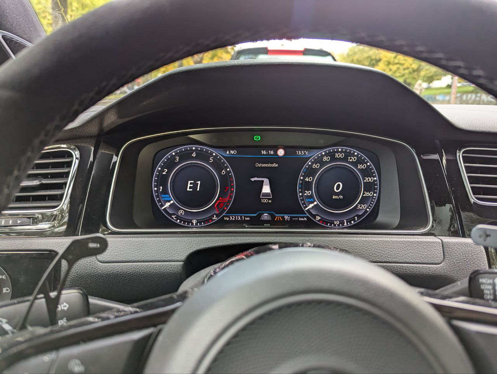
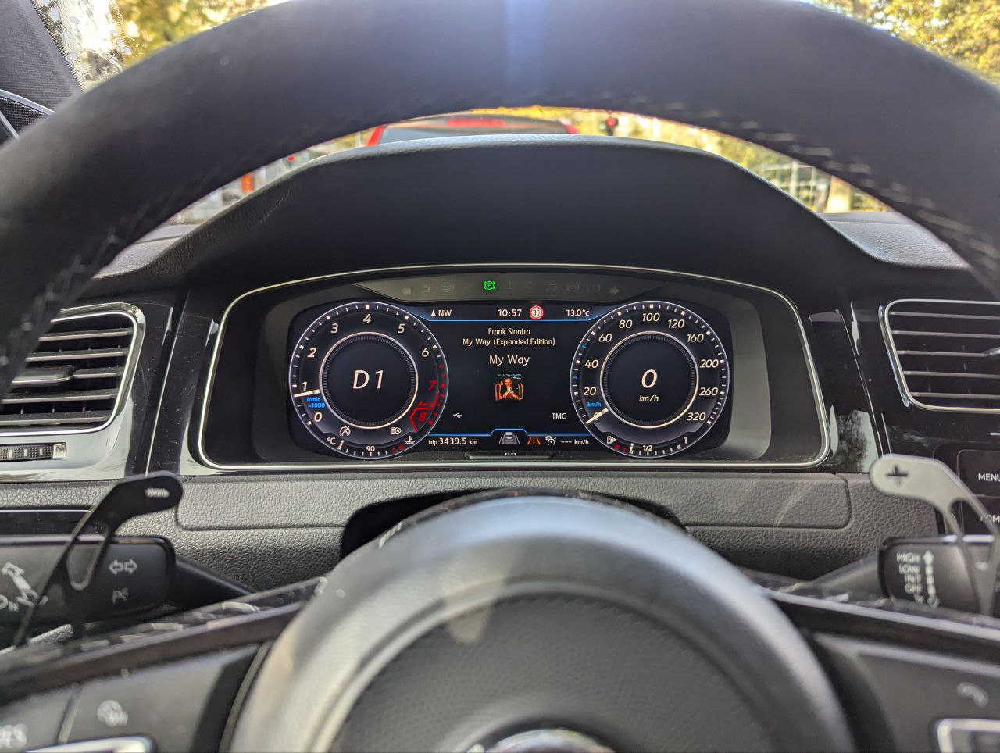

# MIB2 High Android Auto Virtual Cockpit

This project aims to finish what VW start. To bring Navigation and music information from AndroidAuto to the VW Virtual Cockpit.

## Features
- [X] Navigation directions
- [X] Distance to next maneuver
- [ ] ~~ETA and arrival time~~ (Not possible since it is not exposed from AndroidAuto)
- [X] Current title information
  - [X] Title
  - [X] Album
  - [X] Artist
  - [X] Cover art
  - [ ] Show which app is currently playing music
- [ ] Prevent forcing navigation view when navigation starts (I don´t yet know if it is possible)
- [ ] Imperial units (contributions welcome)

### Note
This was tested for SW train: `MHI2_ER_VWG13_P4521`. Feel free to give feedback for other versions.

## Installation

1. Download the latest version of [VCAndroidAuto.jar](https://github.com/adi961/mib2-android-auto-vc/releases/download/latest/VCAndroidAuto.jar)
2. Download the latest version of [installVCAndroidAuto.sh](https://github.com/adi961/mib2-android-auto-vc/releases/download/latest/installVCAndroidAuto.sh)
3. Copy both to the root of your sd card
4. ssh into your mib headunit [guide](https://github.com/jilleb/mib2-toolbox/wiki/SSH-Login)
5. and run `/fs/sda0/installVCAndroidAuto.sh`

## Examples

### Navigation

### Current title

## Development

1. Extract your lsd.jxe from your headunit
2. copy it to the root of this repository
3. run `make lsd` to extract your lsd.jxe
4. to add a class to the patch run `make extractOriginal the.class.path.ClassName`
5. edit the class in the src folder

Based on the great work of [grajen3](https://github.com/grajen3/mib2-lsd-patching) and [andrewleech](https://github.com/andrewleech)
